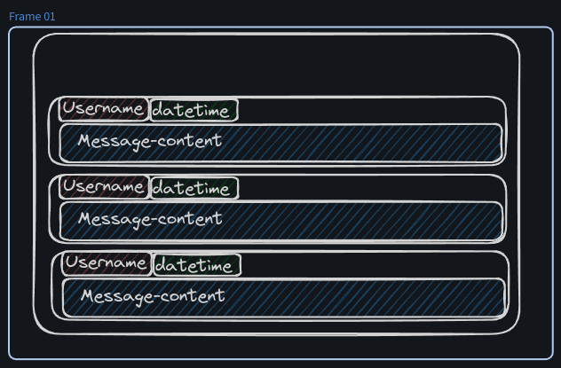
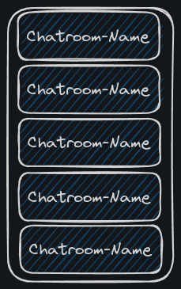
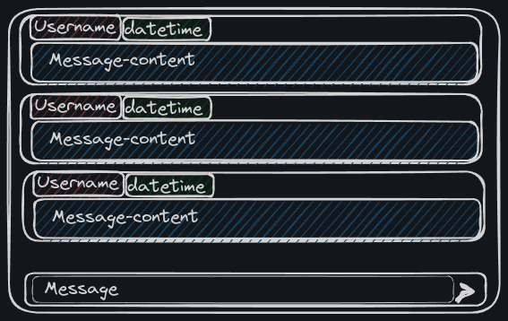
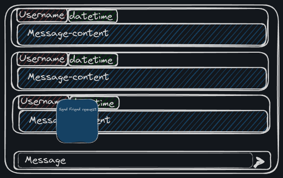
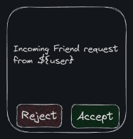

### User Stories:

## Chatroom

> As a *User*
> I am able to *get in a chat available to me*
> so that I can *view messages in a chatroom*

### Wireframe

### Acceptance Criteria

- Ability to view messages linked to a specific chatroom.
- Should display the user that sent the message, the date and time of the message being sent, and the message content.
- Orders them by most recent at the bottom.
- The ability to scroll up to view the message history.

## Overview Chatrooms

> As a *User*
> I am able to *get a list of chatrooms I am assigned to*
> so that I can *see which chatrooms are available for me*

### Wireframe

### Acceptance Criteria

- A list of chats with their name displayed.
- When a chat is clicked, the chat needs to be highlighted.
- When a chat is clicked, the chat should open on the screen.

## Send Message

> As a *User*
> I am able to *send a message to another user*
> so that I can *communicate with them*

### Wireframe

### Acceptance Criteria

- Ability to type and send a message.
- The message should appear in the chatroom in real-time.
- The message should be stored in the database with the correct sender and receiver information.

## Receive Message

> As a *User*
> I am able to *receive messages from another user in real-time*
> so that I can *communicate with them*

### Acceptance Criteria

- Messages sent by another user should appear in the chatroom in real-time.
- The message should be stored in the database with the correct sender and receiver information.

## Friend Request

> As a *User*
> I am able to *send a friend request to another user*
> so that I can *associate with a user*

### Wireframe

- Clicking on a user shows a popup that allows you to send a friend request.

### Acceptance Criteria

- Ability to send a friend request to another user.
- The friend request should be stored in the database with the correct sender and receiver information.

## Overview Friend Requests

> As a *User*
> I am able to *view my friend requests*
> so that I can *accept or reject a request*

### Wireframe

### Acceptance Criteria

- Ability to view pending friend requests.
- Ability to accept or reject a friend request.
- The friend request status should be updated in the database.

## Chat API

### Endpoints:

1. **User Authentication:**
    - `POST /api/auth/register`: Register a new user.
    - `POST /api/auth/login`: Log in a user.
    - `POST /api/auth/logout`: Log out a user.

2. **Friend Requests:**
    - `POST /api/friends/request`: Send a friend request.
    - `GET /api/friends/requests`: Get pending friend requests.
    - `POST /api/friends/requests/{requestId}/accept`: Accept a friend request.
    - `POST /api/friends/requests/{requestId}/reject`: Reject a friend request.

3. **Chats:**
    - `GET /api/chats`: Get a list of chatrooms for the user.
    - `GET /api/chats/{chatId}`: Get messages for a specific chatroom.
    - `POST /api/chats/{chatId}/messages`: Send a message to a chatroom.

4. **Real-time Messaging:**
    - Implement WebSocket in the backend for real-time messaging as the database supports WebSockets.

